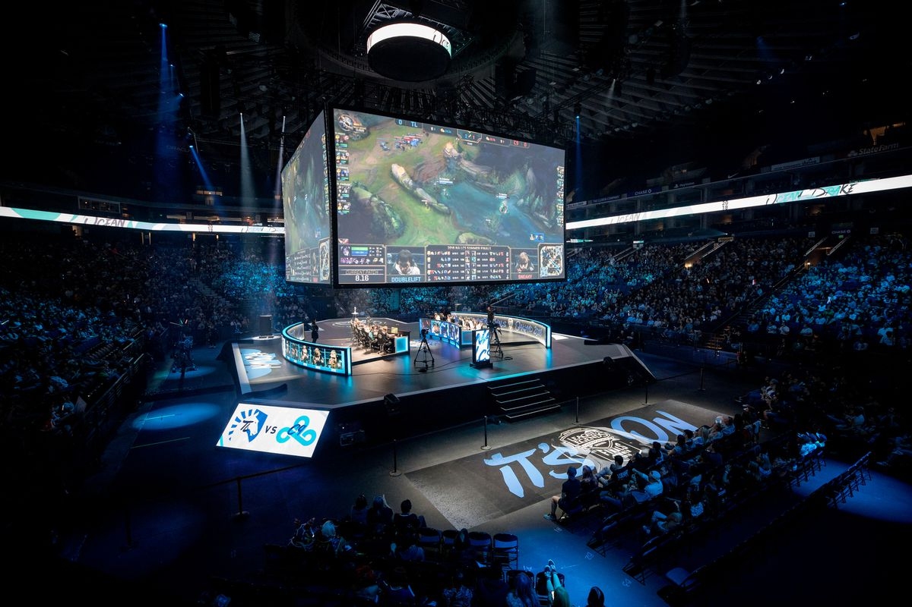

# 2021 Spring Player Rankings

 

This brings us to the end of the Spring Split!  Here's a quick look at the definitive All-Pro List:

## ***1st Team***
**Top**: EG Impact (3 1st, 1 2nd)  
**Jungle**: C9 Blaber (3 1st, 1 2nd, 2 3rd) 
**Mid**: TL Bjergsen (4 1st, 1 2nd) 
**ADC**: EG Danny (4 1st, 2 3rd) 
**Support**: TL CoreJJ (5 1st, 1 2nd) 

## ***2nd Team***
**Top**: TL Bwipo (2 1st, 2 2nd) 
**Jungle**: 100T Closer (3 2nd, 3 3rd) 
**Mid**: C9 Fudge (2 2nd, 3 3rd) / EG Jojopyun (2 1st, 1 2nd) 
**ADC**: C9 Berserker (1 1st, 3 2nd, 2 3rd) / TL Hans Sama (1 1st, 3 2nd, 2 3rd) 
**Support**: EG Vulcan (1 1st, 4 2nd) 

## ***3rd Team***
**Top**: C9 Summit (1 1st, 1 2nd, 3 3rd) 
**Jungle**: TL Santorin (2 1st, 1 3rd) 
**Mid**: C9 Fudge (2 2nd, 3 3rd) / EG Jojopyun (2 1st, 1 2nd) 
**ADC**: C9 Berserker (1 1st, 3 2nd, 2 3rd) / TL Hans Sama (1 1st, 3 2nd, 2 3rd) 
**Support**: 100T Huhi (1 2nd, 5 3rd) 

  
# **Top**
|                    |   Johann |   Milad |   Tak |   Joimes |   Zain |   Kwan |   Average Rank |   Lowest |   Highest |
|:-------------------|---------:|--------:|------:|---------:|-------:|-------:|---------------:|----------:|---------:|
| Top [EG Impact]    |        2 |       1 |     4 |        1 |      1 |      4 |        2.17 |         4 |        1 |
| Top [TL Bwipo]     |        4 |       2 |     1 |        4 |      2 |      1 |        2.33 |         4 |        1 |
| Top [C9 Summit]    |        1 |       4 |     3 |        3 |      3 |      2 |        2.67 |         4 |        1 |
| Top [100T Ssumday] |        3 |       3 |     2 |        2 |      4 |      3 |        2.83 |         4 |        2 |
| Top [GGS Licorice] |        7 |       6 |     7 |        6 |      5 |      5 |        6       |         7 |        5 |
| Top [TSM Huni]     |        5 |       7 |     5 |        7 |      7 |      8 |        6.5     |         8 |        5 |
| Top [IMT Revenge]  |        6 |       5 |     6 |        5 |      9 |      9 |        6.67 |         9 |        5 |
| Top [CLG Jenkins]  |        9 |       8 |     8 |        8 |      8 |      6 |        7.83 |         9 |        6 |
| Top [FLY Kumo]     |        8 |      10 |     9 |        9 |      6 |     10 |        8.67 |        10 |        6 |
| Top [DIG FakeGod]  |       10 |       9 |    10 |       10 |     10 |      7 |        9.33 |        10 |        7 |

# **Jungle**

|                           |   Johann |   Milad |   Tak |   Joimes |   Zain |   Kwan |   Average Rank |   Lowest |   Highest |
|:--------------------------|---------:|--------:|------:|---------:|-------:|-------:|---------------:|----------:|---------:|
| Jungle [C9 Blaber]        |        1 |       2 |     1 |        3 |      1 |      3 |        1.83 |         3 |        1 |
| Jungle [100T Closer]      |        3 |       3 |     2 |        2 |      3 |      2 |        2.5     |         3 |        2 |
| Jungle [TL Santorin]      |        4 |       4 |     3 |        1 |      4 |      1 |        2.83 |         4 |        1 |
| Jungle [EG Inspired]      |        2 |       1 |     4 |        4 |      2 |      7 |        3.33 |         7 |        1 |
| Jungle [GGS Pridestalker] |        7 |       5 |     5 |        5 |      6 |      5 |        5.5     |         7 |        5 |
| Jungle [TSM Spica]        |        6 |       8 |     7 |        6 |      7 |      6 |        6.67 |         8 |        6 |
| Jungle [DIG River]        |        5 |       6 |     6 |        7 |      8 |     10 |        7       |        10 |        5 |
| Jungle [FLY Josedeodo]    |        8 |       9 |     8 |        8 |      5 |      8 |        7.67 |         9 |        5 |
| Jungle [IMT Xerxe]        |        9 |       7 |     9 |        9 |      9 |      9 |        8.67 |         9 |        7 |
| Jungle [CLG Contractz]    |       10 |      10 |    10 |       10 |     10 |      4 |        9       |        10 |        4 |

# **Mid**

|                       |   Johann |   Milad |   Tak |   Joimes |   Zain |   Kwan |   Average Rank |   Lowest |   Highest |
|:----------------------|---------:|--------:|------:|---------:|-------:|-------:|---------------:|----------:|---------:|
| Mid [TL Bjergsen]     |        1 |       4 |     1 |        2 |      1 |      1 |        1.67 |         4 |        1 |
| Mid [C9 Fudge]        |        4 |       3 |     2 |        3 |      3 |      2 |        2.83 |         4 |        2 |
| Mid [EG Jojopyun]     |        2 |       1 |     5 |        1 |      4 |      4 |        2.83 |         5 |        1 |
| Mid [100T Abbedagge]  |        3 |       2 |     3 |        5 |      2 |      3 |        3       |         5 |        2 |
| Mid [FLY Toucouille]  |        5 |       5 |     4 |        4 |      6 |      6 |        5       |         6 |        4 |
| Mid [DIG Blue]        |        6 |       6 |     6 |        6 |      5 |     10 |        6.5     |        10 |        5 |
| Mid [IMT POE]         |        7 |       7 |     8 |        7 |      7 |      9 |        7.5     |         9 |        7 |
| Mid [GGS Ablazeolive] |       10 |       9 |     9 |        8 |      9 |      5 |        8.33 |        10 |        5 |
| Mid [TSM Takeover]    |        8 |      10 |     7 |       10 |     10 |      7 |        8.67|        10 |        7 |
| Mid [CLG Palafox]     |        9 |       8 |    10 |        9 |      8 |      8 |        8.67 |        10 |        8 |

# **ADC**

|                    |   Johann |   Milad |   Tak |   Joimes |   Zain |   Kwan |   Average Rank |   Lowest |   Highest |
|:-------------------|---------:|--------:|------:|---------:|-------:|-------:|---------------:|----------:|---------:|
| ADC [EG Danny]     |        3 |       1 |     3 |        1 |      1 |      1 |        1.66 |         3 |        1 |
| ADC [C9 Berserker] |        2 |       2 |     1 |        3 |      3 |      2 |        2.17 |         3 |        1 |
| ADC [TL Hans Sama] |        1 |       3 |     2 |        2 |      2 |      3 |        2.17|         3 |        1 |
| ADC [100T FBI]     |        4 |       4 |     4 |        4 |      4 |      4 |        4       |         4 |        4 |
| ADC [TSM Tactical] |        6 |       8 |     5 |        6 |      5 |      5 |        5.83 |         8 |        5 |
| ADC [DIG Neo]      |        7 |       6 |     6 |        7 |      6 |     10 |        7       |        10 |        6 |
| ADC [CLG Luger]    |        5 |       5 |    10 |        5 |     10 |      8 |        7.17 |        10 |        5 |
| ADC [GGS Lost]     |        8 |       7 |     7 |        8 |      8 |      6 |        7.33 |         8 |        6 |
| ADC [FLY Johnsun]  |       10 |      10 |     9 |        9 |      7 |      7 |        8.67 |        10 |        7 |
| ADC [IMT Arrow]    |        9 |       9 |     8 |       10 |      9 |      9 |        9       |        10 |        8 |

# **Support**

|                        |   Johann |   Milad |   Tak |   Joimes |   Zain |   Kwan |   Average Rank |   Lowest |   Highest |
|:-----------------------|---------:|--------:|------:|---------:|-------:|-------:|---------------:|----------:|---------:|
| SUP [TL CoreJJ]        |        1 |       2 |     1 |        1 |      1 |      1 |        1.17 |         2 |        1 |
| SUP [EG Vulcan]        |        2 |       1 |     2 |        2 |      2 |      4 |        2.17 |         4 |        1 |
| SUP [100T Huhi]        |        3 |       3 |     3 |        3 |      3 |      2 |        2.83 |         3 |        2 |
| SUP [C9 Winsome/Isles] |        7 |       5 |     5 |        6 |      6 |      3 |        5.33 |         7 |        3 |
| SUP [DIG Biofrost]     |        6 |       8 |     7 |        4 |      4 |      5 |        5.67 |         8 |        4 |
| SUP [FLY Aphromoo]     |        4 |       4 |     6 |        7 |      7 |      7 |        5.83 |         7 |        4 |
| SUP [GGS Olleh]        |        8 |       6 |     8 |        5 |      5 |      6 |        6.33 |         8 |        5 |
| SUP [TSM Shenyi]       |        5 |      10 |     4 |        9 |     10 |      9 |        7.83 |        10 |        4 |
| SUP [CLG Poome]        |        9 |       7 |     9 |       10 |      9 |      8 |        8.67 |        10 |        7 |
| SUP [IMT Destiny]      |       10 |       9 |    10 |        8 |      8 |     10 |        9.17|        10 |        8 |

